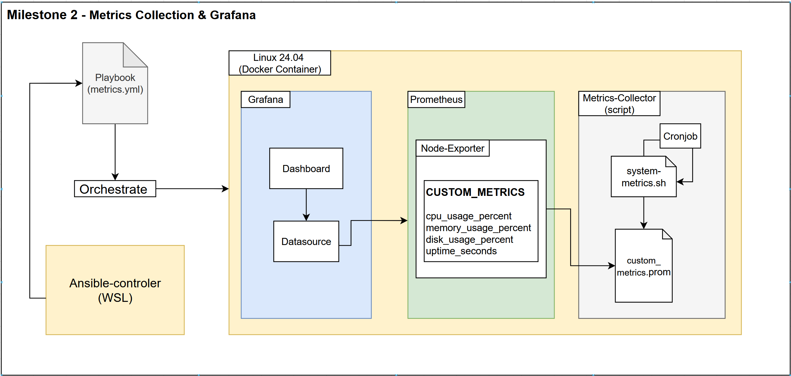

---

## Milestone 2 - Monitoring and Visualization

### Project Architecture



### Prepare docker image with new services

In this new Milestone cronjob was needed to execute periodically metrics. The ubuntu docker images does not cronjob installed, so we need to pre-install it on the Dockerfile and also enable the service.

```dockerfile
FROM ubuntu:24.04

# Avoid prompts during install
ENV DEBIAN_FRONTEND=noninteractive

# Update and install core tools
RUN apt update && \
    apt install -y \
        openssh-server \
        python3 python3-pip python3-apt \
        sudo git curl wget vim net-tools \
        apt-transport-https ca-certificates lsb-release gnupg \
        cron && \
    mkdir /var/run/sshd && \
    echo 'root:root' | chpasswd && \
    sed -i 's/#PermitRootLogin prohibit-password/PermitRootLogin yes/' /etc/ssh/sshd_config && \
    sed -i 's/PasswordAuthentication no/PasswordAuthentication yes/' /etc/ssh/sshd_config

# Optional: Install Docker CLI (not the full Docker Engine)
RUN curl -fsSL https://download.docker.com/linux/ubuntu/gpg | gpg --dearmor -o /usr/share/keyrings/docker.gpg && \
    echo "deb [arch=$(dpkg --print-architecture) signed-by=/usr/share/keyrings/docker.gpg] \
    https://download.docker.com/linux/ubuntu $(lsb_release -cs) stable" > /etc/apt/sources.list.d/docker.list && \
    apt update && apt install -y docker-ce-cli

RUN pip install --break-system-packages docker requests

# Create startup script to run both SSH and cron
RUN echo '#!/bin/bash\nservice cron start\n/usr/sbin/sshd -D' > /start.sh && \
    chmod +x /start.sh

# Expose SSH
EXPOSE 22

# Start both cron and SSH daemon
CMD ["/start.sh"]
```

After recreating we are ready to start the milestone

### Write a script to gather CPU, memory, disk, and uptime metrics

#### Overview

This milestone implements a comprehensive monitoring stack using Docker containers orchestrated by Ansible. The solution collects system metrics (CPU, memory, disk usage), stores them in Prometheus, and visualizes them through Grafana dashboards.

#### Architecture

The monitoring solution consists of:

- **Custom metrics collection script** running via cron jobs
- **Prometheus** for metrics storage and collection
- **Node Exporter** for system metrics exposure
- **Grafana** for data visualization and dashboards
- **Automated deployment** via Ansible playbooks

### Project Architecture


### Metrics Collection Implementation

#### System Metrics Script

Created `system-metrics.sh` to collect CPU, memory, and disk metrics:

```bash
#!/bin/bash
# Generate system metrics for Prometheus textfile collector

METRICS_DIR="/var/lib/node_exporter/textfile_collector"
METRICS_FILE="$METRICS_DIR/system_metrics.prom"

mkdir -p "$METRICS_DIR"

# CPU Usage (percentage)
CPU_USAGE=$(top -bn1 | grep "Cpu(s)" | awk '{print $2}' | awk -F'%' '{print 100-$1}')

# Memory Usage (percentage)
MEMORY_USAGE=$(free | grep Mem | awk '{printf "%.2f", ($3/$2) * 100.0}')

# Disk Usage (percentage) for root filesystem
DISK_USAGE=$(df / | tail -1 | awk '{print $5}' | sed 's/%//')

# Generate Prometheus metrics
cat > "$METRICS_FILE" << EOF
# HELP system_cpu_usage_percent System CPU usage percentage
# TYPE system_cpu_usage_percent gauge
system_cpu_usage_percent $CPU_USAGE

# HELP system_memory_usage_percent System memory usage percentage
# TYPE system_memory_usage_percent gauge
system_memory_usage_percent $MEMORY_USAGE

# HELP system_disk_usage_percent System disk usage percentage
# TYPE system_disk_usage_percent gauge
system_disk_usage_percent $DISK_USAGE
EOF
```

**Key Features:**

- Collects CPU usage using `top` command
- Calculates memory usage percentage from `/proc/meminfo` via `free`
- Monitors root filesystem disk usage with `df`
- Outputs metrics in Prometheus format compatible with textfile collector
- Creates metrics directory automatically if it doesn't exist

#### Sub-minute Collection Runner

Implemented `subminute_runner.sh` for frequent metric collection:

```bash
#!/bin/bash
# Run system metrics collection every 10 seconds for 1 minute

for i in {1..6}; do
    /opt/metrics/system-metrics.sh
    if [ $i -lt 6 ]; then
        sleep 10
    fi
done
```

This script runs the metrics collection 6 times with 10-second intervals, providing sub-minute granularity.

#### Cron Job Configuration

Configured automated execution via cron:

```bash
# Run every minute to collect metrics more frequently
* * * * * /opt/metrics/subminute_runner.sh
```

### Docker Infrastructure

#### Docker Compose Orchestration

Implemented 2 docker-compose to setup the monitoring stack, one for prometheus and node-exporter, and the other for grafana:

docker-compose (prometheus/node-exporter):

```yaml
services:
  prometheus:
    image: prom/prometheus:latest
    container_name: prometheus
    ports:
      - "9090:9090"
    volumes:
      - prometheus_data:/prometheus
    command:
      - '--config.file=/etc/prometheus/prometheus.yml'
      - '--storage.tsdb.path=/prometheus'
      - '--web.enable-lifecycle'
    restart: unless-stopped
    networks:
      - monitoring

  node-exporter:
    image: prom/node-exporter:latest
    container_name: node-exporter
    ports:
      - "9100:9100"
    volumes:
      - metrics_data:/var/lib/node_exporter/textfile_collector
      - /proc:/host/proc:ro
      - /sys:/host/sys:ro
      - /:/rootfs:ro
    command:
      - '--path.procfs=/host/proc'
      - '--path.rootfs=/rootfs'
      - '--path.sysfs=/host/sys'
      - '--collector.textfile.directory=/var/lib/node_exporter/textfile_collector'
    restart: unless-stopped
    networks:
      - monitoring

volumes:
  prometheus_data:
  metrics_data:

networks:
  monitoring:
    external: true
    name: monitoring
```

docker-compose (grafana):

```yaml
services:
  grafana:
    image: grafana/grafana:latest
    container_name: grafana
    ports:
      - "3000:3000"
    volumes:
      - ./provisioning:/etc/grafana/provisioning
      - ./dashboards:/var/lib/grafana/dashboards
      - grafana_data:/var/lib/grafana
    environment:
      - GF_SECURITY_ADMIN_USER=admin
      - GF_SECURITY_ADMIN_PASSWORD=admin
      - GF_USERS_ALLOW_SIGN_UP=false
    restart: unless-stopped
    networks:
      - monitoring

volumes:
  grafana_data:

networks:
  monitoring:
    external: true
    name: monitoring
```

**Infrastructure Highlights:**

- Persistent volumes for data retention
- Proper volume mounts for textfile collector integration
- Auto-restart policies for high availability
- Grafana provisioning for automated configuration

### Grafana Configuration

#### Datasource Provisioning

Automated Prometheus datasource configuration:

```yaml
apiVersion: 1

datasources:
  - name: Prometheus
    type: prometheus
    access: proxy
    url: http://prometheus:9090
    isDefault: true
    uid: prometheus
```

The "uid" configuration is very important, it make sure to connect to that specific datasource. At first I did not have this setting, and grafana was not finding the correct datasource.

### Prometheus Configuration

Created `prometheus.yml` with custom configuration:

```yaml
global:
  scrape_interval: 15s
  evaluation_interval: 15s

scrape_configs:
  - job_name: 'prometheus'
    static_configs:
      - targets: ['localhost:9090']

  - job_name: 'node_exporter'
    static_configs:
      - targets: ['node_exporter:9100']
```

**Configuration Details:**

- 15-second scrape interval for real-time monitoring
- Monitors both Prometheus itself and Node Exporter
- Uses Docker service names for container communication

### Dashboard Implementation

Created comprehensive system metrics dashboard (`system-metrics-dashboard.json`) featuring:

**CPU Metrics Panel:**

- Real-time CPU usage percentage
- Time-series visualization
- Color-coded thresholds (green < 50%, yellow < 80%, red ≥ 80%)

**Memory Metrics Panel:**

- Memory usage percentage tracking
- Historical trend analysis
- Alert thresholds for high memory usage

**Disk Usage Panel:**

- Root filesystem utilization
- Storage capacity monitoring
- Critical usage warnings

**Dashboard Features:**

- Auto-refresh every 5 seconds
- Responsive design for different screen sizes
- Interactive time range selection
- Prometheus query integration

### Ansible Automation

#### Metrics Collector Role

Created comprehensive Ansible role (`metrics_collector`) for automated deployment:

- Copy scripts (system-metrics.sh and subminute_runner.sh) to the target host;
- Create log and metrics directory's to match docker-compose mounts;
- Add a cronjob to the system and run the subminute_runner.sh file;

#### Prometheus Role

Created comprehensive Ansible role (Prometheus) for automated deployment:

- Check if prometheus dir exists;
- Copy config files from prometheus;
- Create monitoring network;
- Start Prometheus and node-exporter container
- After Prometheus container is running copy the rest of the configs (This can be updated)

#### Grafana Role

Created comprehensive Ansible role (Grafana) for automated deployment:

- Create Grafana dir;
- Copy config files from Grafana;
- Copy provisioning files (dashboard and datasource)
- Create monitoring network;
- Start Grafana container;
- After Grafana container is runing copy the rest of the configs (This can be updated)

#### Monitoring Stack Deployment

Main playbook (`metrics.yml`) orchestrates the complete deployment:

```yaml
---
- name: Deploy monitoring infrastructure
  hosts: local_nodes
  become: yes
  roles:
    - metrics_collector
    - prometheus
    - grafana

- name: Verify deployment
  hosts: local_nodes
  become: yes
  tasks:
    - name: Check if metrics collection is working
      stat:
        path: /var/lib/node_exporter/textfile_collector/system_metrics.prom
      register: metrics_file

    - name: Display metrics file status
      debug:
        msg: "Metrics file exists: {{ metrics_file.stat.exists }}"
```

### Deployment and Verification

We can deploy the monitoring system by:

```bash
ansible-playbook playbooks/metrics.yml
```

#### Service Verification

All monitoring services are running correctly:

```bash
CONTAINER ID   IMAGE                       COMMAND                  STATUS
a1b2c3d4e5f6   grafana/grafana:latest     "/run.sh"               Up 2 hours
b2c3d4e5f6a1   prom/prometheus:latest     "/bin/prometheus --c…"   Up 2 hours
c3d4e5f6a1b2   prom/node-exporter:latest  "/bin/node_exporter …"   Up 2 hours
```

#### Access Points

The monitoring stack is accessible via:

- **Prometheus UI**: [http://localhost:9090](http://localhost:9090/)
- **Grafana Dashboard**: [http://localhost:3000](http://localhost:3000/) (admin/admin)
- **Node Exporter Metrics**: [http://localhost:9100](http://localhost:9100/)

### Project Structure at Milestone 2

```
OnboardingChallenge/
├── ansible-project/
│   ├── ansible.cfg
│   ├── inventory/
│   │   └── inventory.ini
│   ├── playbooks/
│   │   ├── metrics.yml          # Monitoring deployment playbook
│   │   ├── reset-metrics.yml    # Cleanup and reset playbook
│   │   └── site.yml            # Main configuration playbook
│   └── roles/
│       ├── grafana/            # Grafana configuration role
│       │   ├── files/
│       │   │   ├── docker-compose.yml
│       │   │   ├── dashboards/
│       │   │   │   └── system-metrics-dashboard.json
│       │   │   └── provisioning/
│       │   │       ├── dashboards/
│       │   │       │   ├── dashboard.yml
│       │   │       │   └── metrics-dashboard.json
│       │   │       └── datasources/
│       │   │           └── datasource.yml
│       │   └── tasks/
│       │       └── main.yml
│       ├── metrics_collector/   # Custom metrics collection role
│       │   ├── files/
│       │   │   ├── subminute_runner.sh
│       │   │   └── system-metrics.sh
│       │   └── tasks/
│       │       └── main.yml
│       ├── moon-buggy/         # Game installation role
│       │   ├── defaults/
│       │   │   └── main.yml
│       │   └── tasks/
│       │       └── main.yml
│       └── prometheus/         # Prometheus configuration role
│           ├── files/
│           │   ├── docker-compose.yml
│           │   └── prometheus.yml
│           └── tasks/
│               └── main.yml
├── infra-project/
│   ├── Monitoring/            # Additional monitoring utilities
│   │   ├── gather_metrics/
│   │   │   └── system_metrics.sh
│   │   └── grafana-prometheus_setup/
│   ├── VM-Configuration/
│   │   ├── docker-compose.yml
│   │   └── Dockerfile
└── README.md                  # This comprehensive documentation
```

---
### Improvements on M2

- Instead of deploying Grafana/Prometheus configuration after Grafana/Prometheus containers are running, mount a volume with the configurations in the docker-compose file;

- Create the Monitoring network layer inside the docker-compose file, instead of creating it in the role;
